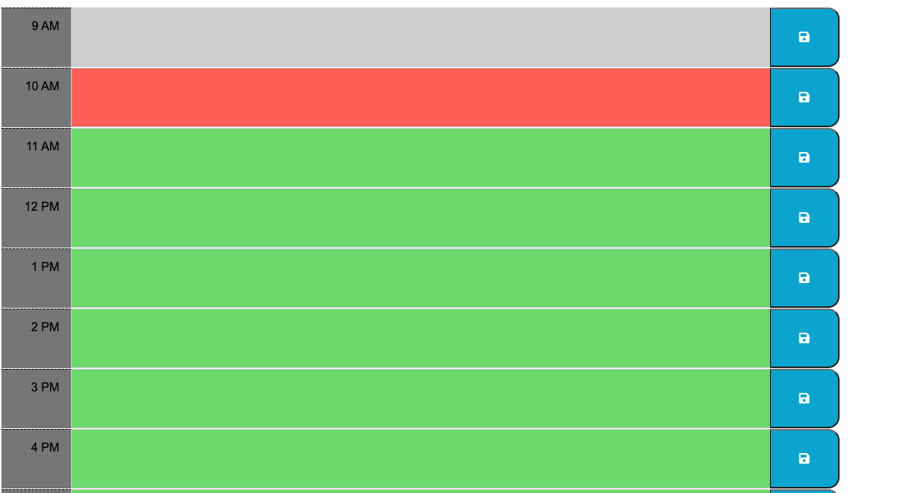

# Daily Planner README

This daily planner application provides a convenient way to create and manage your daily schedule. Below is a breakdown of its features and functionalities:

## Features

1. **Display of Current Day**: Upon opening the planner, the current day is prominently displayed at the top of the calendar.
2. **Time Block Presentation**: As you scroll down, time blocks for standard business hours from 9am to 5pm are presented, allowing you to plan your day effectively.
3. **Color-Coded Time Blocks**: Each time block is color-coded to indicate whether it's in the past, present, or future, providing visual cues for your schedule.
4. **Event Input**: Clicking into a time block allows you to enter an event or task for that specific hour.
5. **Local Storage**: The application saves entered events locally, ensuring that your schedule persists even after refreshing the page.

## Usage

1. **Opening the Planner**: Open the planner to start organizing your day using this link : https://chadoyek.github.io/Work-Day-Scheduler-Challenge-5/
2. **Viewing Time Blocks**: Scroll down to view time blocks for the day, spanning from 9am to 5pm.
3. **Color Coding**: Time blocks are color-coded:
   - Past: Grey
   - Present: Red
   - Future: Green
4. **Entering Events**: Click into a time block to enter an event or task for that hour.
5. **Saving Events**: After entering your event, click the save button associated with the time block to store the event in local storage.
6. **Persistence**: Your saved events will persist even after refreshing the page, ensuring your schedule remains intact.

## Technologies Used

- **Day.js**: Utilized for easy date and time manipulation.
- **jQuery**: Used for DOM manipulation and event handling, providing seamless interaction with the planner.
- **HTML/CSS**: Basic HTML and CSS structure and styling for the planner interface.

## Preview 

## Credits

This project was created by Chadi Hoyek.

Enjoy planning your day with my daily planner!